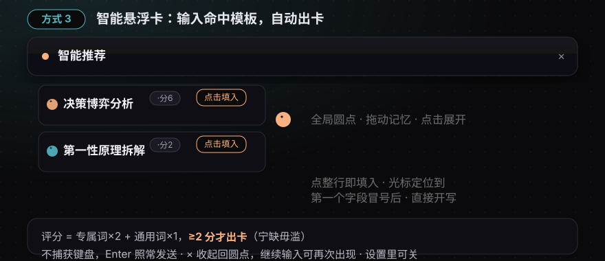

# ⚡ dsh-prompt

**🌐 [中文](README.md) · [English](docs/README.en.md)**

**DeepSeek Harness 的 Prompt 调色板：24 条深度模板、自定义管理、/prompt 触发源、智能推荐悬浮卡——点一下，插入当前对话。**

[](LICENSE)
[](https://www.npmjs.com/package/dsh-prompt)
[](https://github.com/FeatherHunter/dsh-prompt)
[](https://github.com/deepseek-ai/DeepSeek-Harness)


## 📦 本人的其他技能 · More from FeatherHunter

| 仓库 | 痛点 → 解决 |
| --- | --- |
| [🎨 dsh-opencode-palette](https://github.com/FeatherHunter/dsh-opencode-palette) | 看腻了 DSH 默认皮肤？**34 款 opencode 经典主题一键换上**，即点即换。 |
| [🧠 dsh-mattpocock-skills-deck](https://github.com/FeatherHunter/dsh-mattpocock-skills-deck) | AI 只会聊天、不会干活？**25 个工程技能（wayfinder / triage / grilling / handoff）装好即用**。 |
## 痛点

写对话时最烦的三件事：**想不起来用什么 Prompt**、**满屏找历史记录里那条好用的**、**复制粘贴改来改去**。

dsh-prompt 解决它：**点一下，模板正文就进输入框**——不用记忆、不用搜索、不用复制粘贴。

## 一条命令安装

需要 **DSH CLI**（DeepSeek Harness 命令行工具）。还没有就先装：

```bash
npm install -g @deepseek-ai/dsh
```

安装进你的 profile：

```bash
dsh plugin --profile web add dsh-prompt
```

**零配置**：DSH 官方 bundle 机制，包内自带 `cordis.patch.yml`，`dsh plugin add` 自动加入 `dsh.profile.bundles` 装配层；`dsh plugin remove` 干净卸载。重启 DSH（或刷新页面）即生效。

## 它是什么

- **预制 24 条深度 Prompt**（思考框架 10 / 学习 3 / 工程 4 / 执行 7）：第一性原理拆解、苏格拉底式追问、对抗式审查、决策博弈分析、费曼技巧、MECE 拆解、代码审查、测试用例设计、零丢失快照、过程复盘……全部**冒号表单式**：正文 = 指令段 + 字段段，字段是一行「标签：」，你在冒号后直接输入，零删除。
- **自定义模板**：＋新增、编辑、删除（仅限自建 + 二次确认）、预制一键「复制为自定义」。
- **/prompt 触发源**：输入框直接输 `/prompt`，继续输入即按 名称/正文/领域/阶段/动作/标签 过滤，回车或点选即插入。
- **智能悬浮卡**：全局一个低调圆点（可拖动、位置记忆）；输入命中模板时从圆点向右上展开推荐卡，点整行即填入；**不捕获键盘**，Enter 发送不受影响。
- **场景标签**：每模板带 领域×阶段×动作 三维标签，面板按阶段分组 + 领域筛选 + 搜索。
- **跟随 DSH**：字体、字号、颜色跟随主题；界面双语（中文/English）；数据本地持久化。

## /prompt——输入即达


## 智能悬浮卡——匹配即出



评分 = 专属词×2 + 通用词×1，**≥2 分才出卡**（宁缺毋滥）；≤3 候选（top-2 匹配 + 最近使用）；插入后**光标定位到第一个字段的冒号后**，直接开写。

## 30 秒上手

**输入框左侧 ⚡Prompt 按钮** → 面板展开 → 点任意模板 → 插入（光标处优先、不覆盖），面板自动关闭：

- tabs：全部 / 执行前 / 执行中 / 执行后 / 自定义
- 领域行：全领域 / 思考框架 / 学习 / 工程 / 执行
- 搜索：按名称 / 正文 / 标签
- 📌 置顶（≤5）、＋新增、编辑/删除（仅自定义）、复制为自定义

**输入框直接输 `/prompt`** → 斜杠菜单列出（含自定义）→ 回车 / 点选插入。

**智能模式（默认开）**：匹配出卡 → 点整行填入 → × 收起回圆点；设置里可关。

## 设置

**设置 → 提示词模板**（设置面板直属页）：

- 顶部：**GitHub 仓库** / **反馈故障**（一键跳转）
- **智能模式悬浮卡**开关
- **模板管理**：完整 CRUD

## 开发

```bash
npm run build:client   # tsdown → lib/client.js
npm run build          # 完整构建
```

源码 `src/client/*`（面板/触发源/智能匹配/词表/设置页）；匹配引擎与 /prompt 共用数据与排序基础；决策记录见 [issue #1（wayfinding map）](https://github.com/FeatherHunter/dsh-prompt/issues/1)。

## 参与贡献

新预制模板（冒号表单式）、词表打磨、UI 细节、文档翻译——Issue / PR 都欢迎。

## 许可

MIT © FeatherHunter。
