# ⚡ dsh-prompt

**🌐 [中文](../README.md) · [English](README.en.md)**

**A Prompt toolbox for DeepSeek Harness: 24 deep templates, custom management, /prompt trigger source, and a smart suggestion card — click once, inserted into your current conversation.**

[](../LICENSE)
[](https://www.npmjs.com/package/dsh-prompt)
[](https://github.com/FeatherHunter/dsh-prompt)
[](https://github.com/deepseek-ai/DeepSeek-Harness)

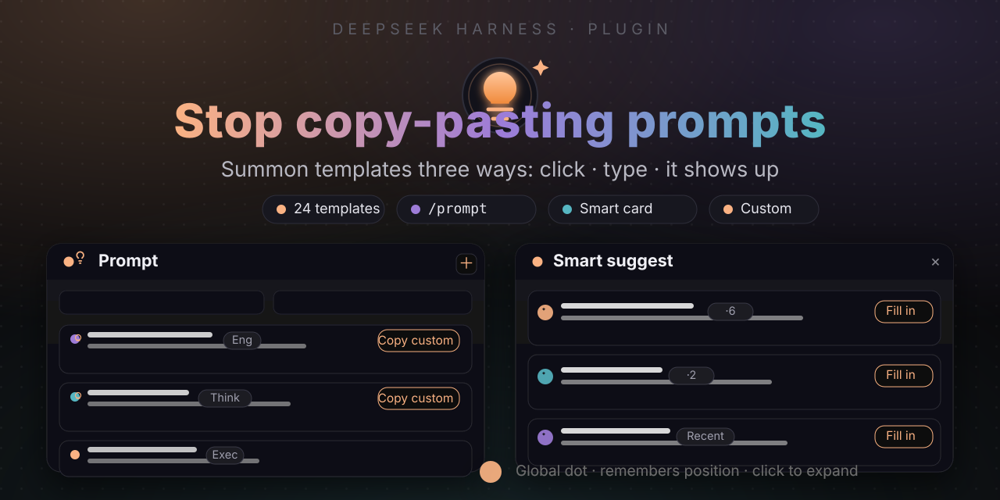

## Quick navigation

[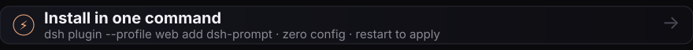](#install-in-one-command)

[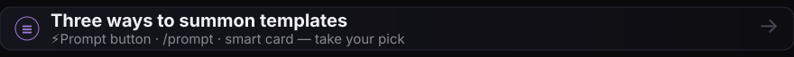](#three-ways-to-summon-templates)

[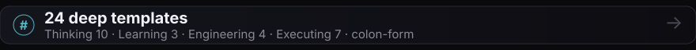](#what-the-templates-look-like)

[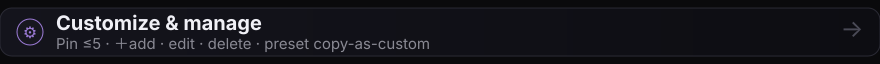](#customization--management)

[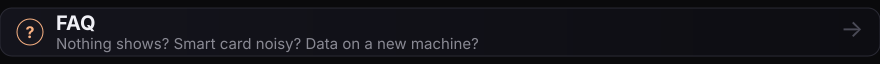](#faq)

[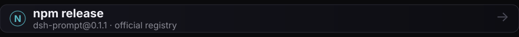](https://www.npmjs.com/package/dsh-prompt)

[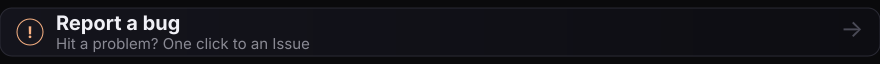](https://github.com/FeatherHunter/dsh-prompt/issues/new)

[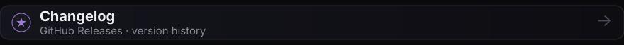](https://github.com/FeatherHunter/dsh-prompt/releases)

## Is this for you

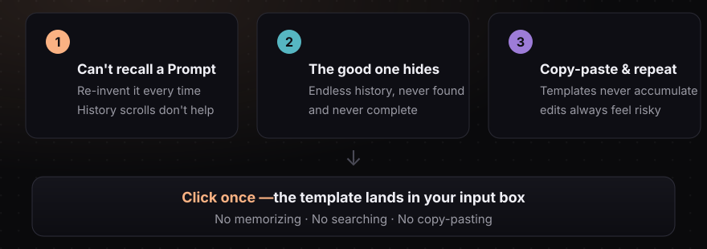

## Install in one command

You need the **DSH CLI** (DeepSeek Harness command-line tool). If you don't have it yet:

```bash
npm install -g @deepseek-ai/dsh
```

Install into your profile:

```bash
dsh plugin --profile web add dsh-prompt
```

**Zero config**: official DSH bundle mechanism — the package ships its own `cordis.patch.yml`, and `dsh plugin add` automatically joins it to the `dsh.profile.bundles` assembly layer; `dsh plugin remove` cleans up. Takes effect after restarting DSH (or refreshing the page).

## Three ways to summon templates

Once installed, templates come from three entry points — pick whichever feels natural:

### 1 · ⚡Prompt button

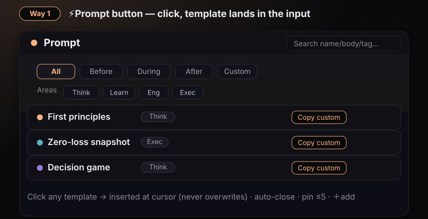

### 2 · /prompt trigger source

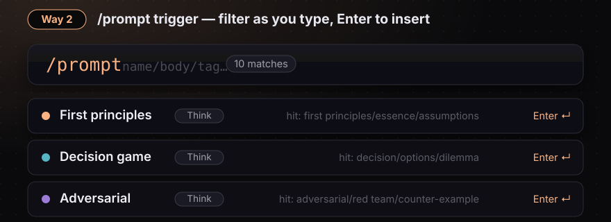

### 3 · Smart suggestion card

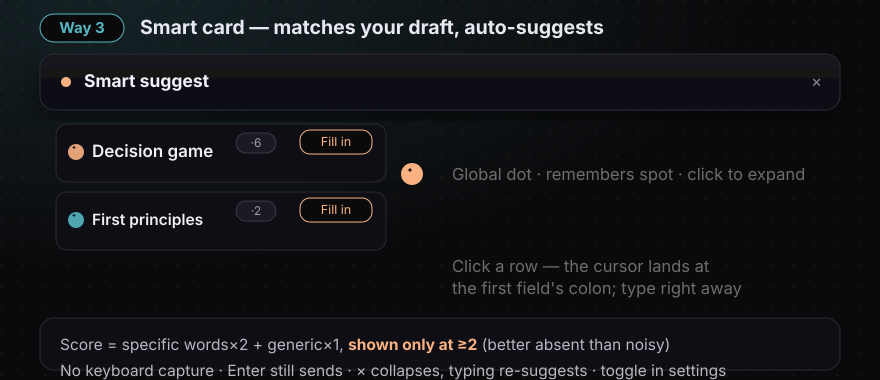

## What the templates look like

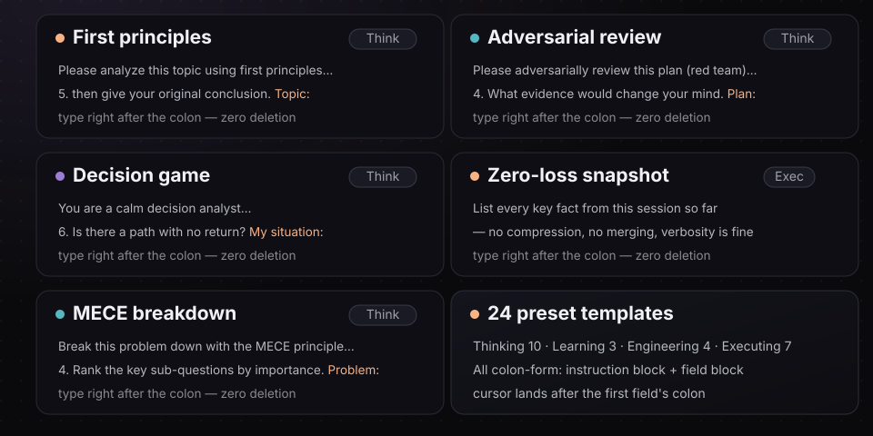

## Customization & management

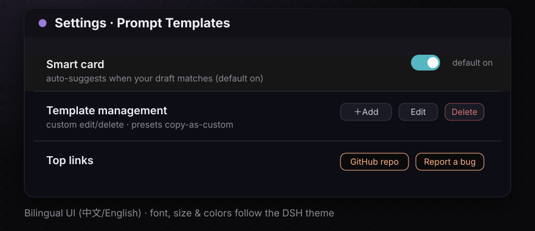

## Privacy

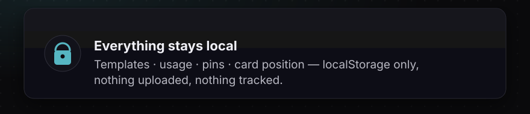

## FAQ

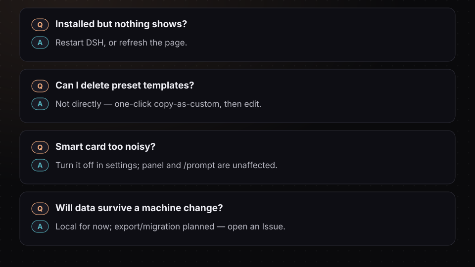

## Development

```bash
npm run build:client   # tsdown → lib/client.js
npm run build          # full build
```

Source in `src/client/*` (panel/trigger/smart matching/word tables/settings page); the matching engine and /prompt share the same data and ranking base; decision records in [issue #1 (wayfinding map)](https://github.com/FeatherHunter/dsh-prompt/issues/1).

## From the same author

Two more DSH plugins:

- [**dsh-opencode-palette**](https://github.com/FeatherHunter/dsh-opencode-palette) — Love opencode's look? Your DSH can wear it too — 34 classic themes, easier on the eyes, happier to code in.
- [**dsh-mattpocock-skills-deck**](https://github.com/FeatherHunter/dsh-mattpocock-skills-deck) — 25 engineering skill packs, paste one install Prompt to use.

## From the author

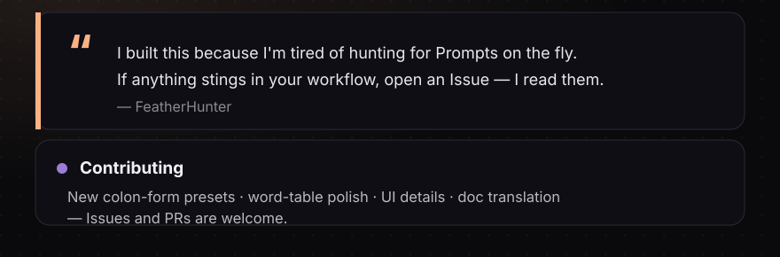

## License

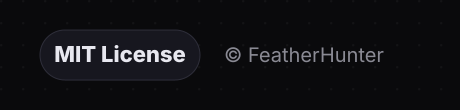
