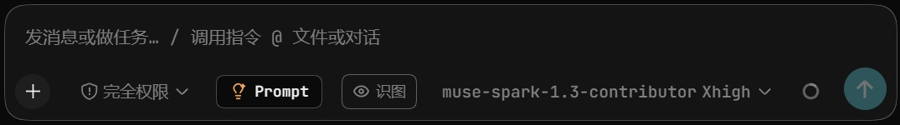
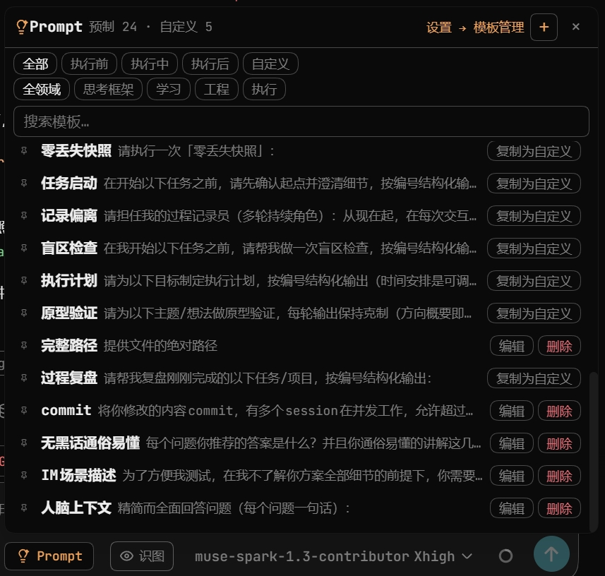
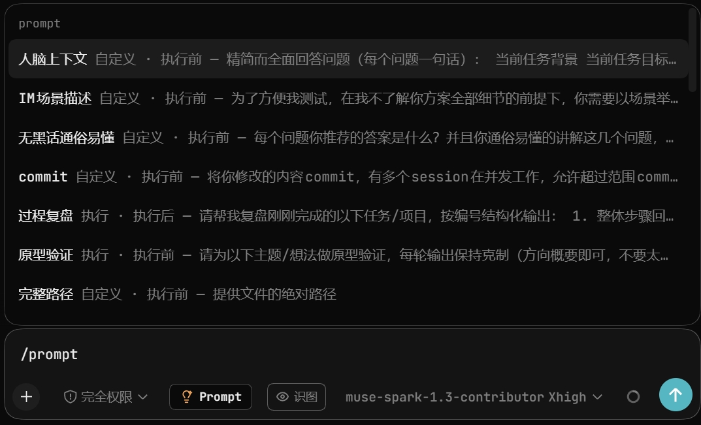
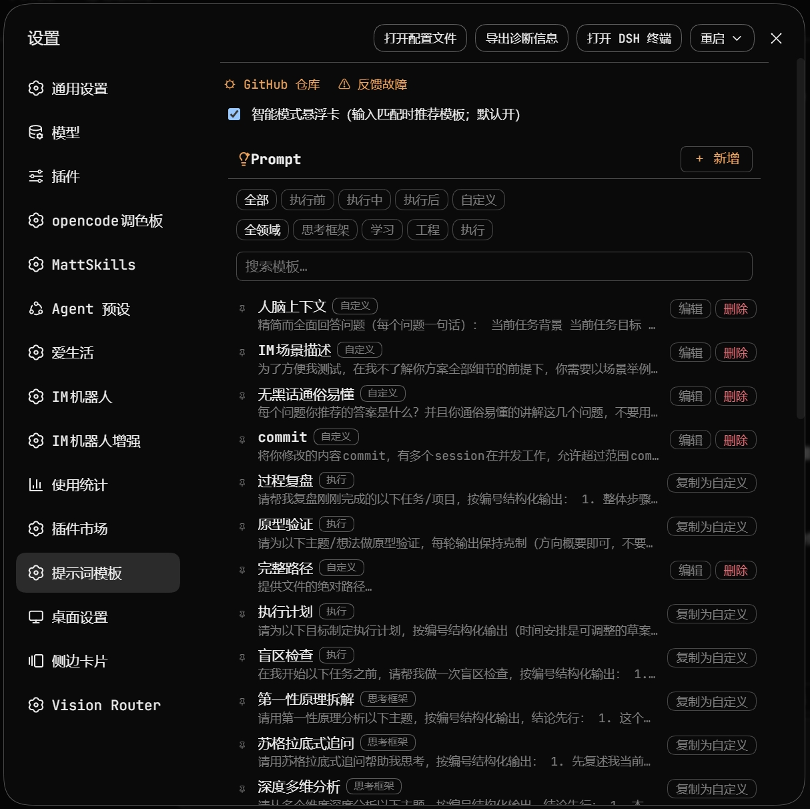
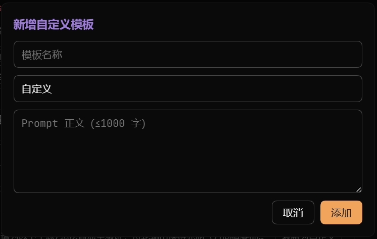

<h1 align="center">dsh-prompt</h1>

<div align="center">

[中文](../README.md) · **English**

**Stop copy-pasting — one click, template in chat.**
24 deep templates, `/prompt` and smart suggestions as backup.<br>
Works out of the box, fully customizable.

Your ⭐ means the world to me.

[](https://www.npmjs.com/package/dsh-prompt) [](https://www.npmjs.com/package/dsh-prompt) [](https://github.com/FeatherHunter/dsh-prompt/commits/main) [](https://github.com/FeatherHunter/dsh-prompt/graphs/commit-activity) [](../LICENSE) [](https://github.com/FeatherHunter/dsh-prompt/blob/main/src/client/templates.ts) [](https://github.com/FeatherHunter/dsh-prompt) [](https://github.com/FeatherHunter/dsh-prompt/issues)

</div>

<h2 align="center"><sub>INSTALL</sub><br>Install</h2>

<div align="center">

Requires [DSH](https://www.npmjs.com/package/@deepseek-ai/dsh) (DeepSeek Harness).<br>
You give the orders, AI does the work.<br>
dsh-prompt turns favorite prompts into clickable templates.

</div>

```bash
# 1. Install the DSH CLI (skip if present)
npm install -g @deepseek-ai/dsh

# 2. Install dsh-prompt — --profile is REQUIRED: install into the profile
#    behind the DSH entry you actually use (wrong profile = silent no-op)
dsh plugin --profile web add dsh-prompt       # self-hosted web service (dsh web)
#     or
dsh plugin --profile desktop add dsh-prompt   # DSH Desktop app
# Pin a version for stability (current 0.1.7):
dsh plugin --profile web add dsh-prompt@0.1.7 --registry https://registry.npmjs.org
```

<div align="center">

Restart the matching entry once.<br>
Desktop: fully quit and reopen. Web: restart and refresh.<br>
Zero config: install and go, remove and it's gone.

**👇 A new button left of the input box means success.**



</div>

<details>
<summary>Advanced: no global install, stale updates, let AI do it</summary>

Examples use the web profile — **DSH Desktop users, replace every `--profile web` with `--profile desktop`**.

```bash
# Without a global install
npx --yes @deepseek-ai/dsh plugin --profile web add dsh-prompt

# When an update is silently skipped, pin the official registry
dsh plugin --profile web add dsh-prompt@latest --registry https://registry.npmjs.org
```

Paste this to your AI and let it confirm the profile, check the environment and install as needed:

```text
Please install the DeepSeek Harness plugin dsh-prompt. Read the repo README first: https://github.com/FeatherHunter/dsh-prompt
First confirm which profile my DSH entry uses (DSH Desktop app → desktop; self-hosted web service → web) and install into the right one;
then check the environment and install as needed (skip what's present), and report back briefly.
```

</details>

Upgrade · uninstall (desktop users: swap `--profile web` for `--profile desktop`):

```bash
dsh plugin --profile web update dsh-prompt   # upgrade
dsh plugin --profile web remove dsh-prompt   # uninstall
```

<h2 align="center"><sub>PROMPT BUTTON</sub><br>Way 1 · Prompt button</h2>

<div align="center">

Hover the ⚡Prompt button and the panel opens (click works too).<br>
Phase tabs + domain filter + search — click a row, body lands in the box.<br>
Most-used sinks to the bottom, closest to the button.

**👇 The panel looks like this.**



</div>

<h2 align="center"><sub>TRIGGER</sub><br>Way 2 · /prompt trigger</h2>

<div align="center">

For keyboard people: type `/prompt`, candidates filter live.<br>
Each row: "name + tags·phase — first 42 characters".<br>
Half a name works too: `/prompt retro`.<br>
(Screenshots are Chinese in v1; layout is identical.)

**👇 Type half, candidates narrow down.**



</div>

<h2 align="center"><sub>SMART CARD</sub><br>Way 3 · Smart suggestion card</h2>

<div align="center">

No need to hunt templates — describe your task, cards pop up on hits.<br>
On by default, one toggle to silence; local word table only, no network.

</div>

<h2 align="center"><sub>TEMPLATES</sub><br>Gallery</h2>

<div align="center">

24 built-ins across four domains and three phases.<br>
Read-only: unbreakable.<br>
Clone to custom to tweak.

**👇 All 24 on one settings page.**



</div>

<h2 align="center"><sub>CUSTOM</sub><br>Customize & manage</h2>

<div align="center">

Save your wording as templates: one click, title + body, done.<br>
Pin up to 5, delete with one confirm.<br>
Separate storage — upgrades never eat yours.

**👇 The new-template dialog.**



</div>

<h2 align="center"><sub>PRIVACY</sub><br>Privacy</h2>

<div align="center">

Templates and counts stay local. Zero network reports.<br>
Removing the plugin removes the data.

</div>

<h2 align="center"><sub>FAQ</sub><br>FAQ</h2>

<details open>
<summary>Still the old version after updating?</summary>

Install once from the official registry (desktop users: swap `--profile web` for `--profile desktop`):

```bash
dsh plugin --profile web add dsh-prompt@latest --registry https://registry.npmjs.org
```

Then restart your entry.<br>
Desktop: fully quit and reopen.<br>
Web: restart and hard-refresh (Ctrl+F5).

</details>

<details>
<summary>No Prompt button after install?</summary>

Check the plugin went into your entry's profile (wrong profile = silent no-op).<br>
Desktop app → `--profile desktop`; web service → `--profile web`.<br>
Then restart that entry once.

</details>

<details>
<summary>Where are custom templates stored? Uploaded anywhere?</summary>

Local browser storage, never uploaded.<br>
Switching browsers or wiping data loses them — back up favorites.

</details>

<h2 align="center"><sub>MORE</sub><br>More from the author</h2>

<div align="center">

If you like this one, these may help too:

**[dsh-opencode-palette](https://github.com/FeatherHunter/dsh-opencode-palette)** — 34 classic opencode themes for DSH, one click to reskin

**[dsh-plugin-ui-debug](https://github.com/FeatherHunter/dsh-plugin-ui-debug)** — closed-loop UI debugging for DSH plugins with a real headless Chrome

**[dsh-mattpocock-skills-deck](https://github.com/FeatherHunter/dsh-mattpocock-skills-deck)** — 25 engineering skill packs, callable right from the panel

**[dsh-chinese-skill-patch](https://github.com/FeatherHunter/dsh-chinese-skill-patch)** — use Chinese skill names in DSH directly, no English renames

---

Questions, ideas? [Open an ISSUE](https://github.com/FeatherHunter/dsh-prompt/issues) — usage chat, template ideas, requests and bugs all welcome

A personal project, not affiliated with DeepSeek Harness.
MIT © FeatherHunter

</div>

<h2 align="center"><sub>THANKS</sub><br>Thanks</h2>

<div align="left">

Thanks to everyone who starred and filed issues — you make this toolbox better, bit by bit.

dsh-prompt is still waiting for its first external contributor.<br>
File an issue, a PR, or share your templates — your name lands here.<br>
Ping me if you already did.

</div>
